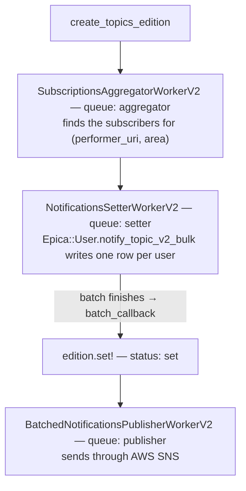

# Normal push (preorder / firstcome / mixed) test sending — how it works

> **In this repo:** this is the reference `POST /api/notifications/normal-pushes` follows — see
> `src/modules/normal-push/service.ts` for what is carried over and what is not. Every file path
> below is in the **ecs-api** repo, not this one.

Notes on what `PushTest::Common.create_topics_edition` does, from the values you pass in to the push
going out. For the steps you run by hand, see the "通常プッシュ通知(preorder, firstcome, mixed)"
part of `doc/misc/プッシュ通知テスト配信.md` in ecs-api.

Related code:

| File | What it does |
|---|---|
| `lib/push_test/common.rb:43` | The method itself |
| `app/models/epica/topics_edition_v2.rb` | The edition: its statuses, `edited!`, `set!`, `set_notifications_async` |
| `app/models/epica/topic_v2.rb` | The topic, and how `performer` links through `subject_uri` |
| `app/models/epica/view_v2.rb:31` | `SHOW_ID_FORMAT` — the regex that reads a show code |
| `app/models/epica/subscription.rb:208` | `each_user_slice_v2` — who really gets the push |
| `app/workers/epica/subscriptions_aggregator_worker_v2.rb` | Step 1 of the pipeline, and the callback that calls `set!` |

---

## What this method is for

It **builds by hand what a cron job normally builds on its own**. On production,
`Epica::TopicsEditionV2.edit` (`app/models/epica/topics_edition_v2.rb:290`) reads the e+ search API
through `each_event` (`:142`), finds the koen whose sale opens in this period, and makes the edition
and its topics from that data.

`create_topics_edition` skips the searching. You name the shows, the performer and the hook yourself,
and then it runs the same three steps: make the edition, make the topics, start the pipeline.
Everything after that is the real production path, not a copy of it.

---

## What the Step 1 snippet really does

```ruby
[
  {
    publish_hour_min: [12, 30],
    shows: [
      ["9014500001-P0030010", 2762, "firstcome"],
      ["9014500001-P0030011", 2762, "preorder"],
    ],
  },
  {
    publish_hour_min: [12, 50],
    shows: [
      ["9028330001-P0030007P021001", 1108, "preorder"],
    ],
  },
].each do |data|
  PushTest::Common.create_topics_edition(**data)
end
```

One hash makes one edition. `**data` turns the hash into the keyword arguments `publish_hour_min:`
and `shows:`. Each item in `shows` is an array of three values, which the block at `:47` reads as
`|code, performer_id, hook|`:

| Position | What it is | Excel column in the test sheet |
|---|---|---|
| 1 | Show code (興行コード) | E |
| 2 | Word ID, which becomes the `Epica::Performer` | F |
| 3 | Hook — `preorder` or `firstcome` | D |

Those two are the only hooks for this method. `in_store` belongs to
`create_in_store_topics_edition`, and `mixed` is explained below.

> **Note**: the old doc writes `create_topics_edition(data)` without `**`. In Ruby 3.x a plain hash is
> no longer turned into keyword arguments, so that form raises `ArgumentError`. Use `**data`.

### How you get a `mixed` push

**`mixed` is not a value you send.** `TopicsEditionV2#type` (`:45`) only looks at the hooks of the
topics **inside one notification**, and returns `'mixed'` when it finds two or more:

```ruby
hooks = notification.topics.map { |topic| topic.hook }.uniq
hooks.size == 1 ? hooks.first : 'mixed'
```

`create_topics_edition` gives every topic the same `will_publish_at` (`edition.period_start`), and
`notify_topic_v2_bulk` (`app/models/epica/user.rb:886`) keys a notification on
`(edition, user_id, will_publish_at)`. So **every topic from one call ends up in the same
notification for each matching user**. That is why one time slot in the test sheet has one 配信文言.

The test sheet has two kinds of `mixed`, and **only one of them** makes `type` return `'mixed'`:

| サブタイプ in the sheet | How it is built | What `type` returns |
|---|---|---|
| `mixed(受付)` | Same ワード, two different shows, **different hooks** (one `preorder`, one `firstcome`) | `'mixed'` |
| `mixed(ワード)` | **Different ワード** on two shows, hooks may be the same | That hook (for example `'preorder'`) — **not** `'mixed'` |

- `mixed(受付)` is the first hash above: one shared word `2762`, two sub codes, two different hooks.
  Anyone subscribed to that word gets both topics, so `type` becomes `'mixed'`.
- `mixed(ワード)` tests the message text for several words, built by `entity_data` (`:55`). It does
  not change `type`. It **only works if the test account subscribes to both words**. If it subscribes
  to only one, the user gets a notification with one word and nothing reports a problem.
- The sheet **does not say** which hook each show in a mixed row should use. You have to pick them:
  `preorder` for one show and `firstcome` for the other. Use the same hook for both and `mixed(受付)`
  will not come out as mixed.

---

## Inside the method (`lib/push_test/common.rb:43-79`)

### 1. Work out the send time (`:44`)

```ruby
will_publish_at = publish_datetime(publish_hour_min[0], publish_hour_min[1])
```

`publish_datetime` (`:26`) is `Time.zone.parse(@date).change(hour:, min:)`. `@date` is kept **on the
class** `PushTest::Common`, so set it before you call anything:

```ruby
PushTest::Common.date = Date.today.to_s
```

Forget this and you get the built-in default `'2021-12-24'` (`:10`) — an edition dated 2021 that will
never be sent.

### 2. Make the edition (`:45`)

```ruby
edition = Epica::TopicsEditionV2.create(period_start: will_publish_at, period_end: will_publish_at + 1.hour)
```

The edition starts with status `created` and has a **one-hour send window**. Two values that come
from it matter later:

- `publish_range` = `period_start...period_end` (`:133`)
- `publish_starts_at` = `period_end - 1.hour`. With a one-hour window this **is exactly
  `period_start`**.

### 3. Turn each show code into one or more koen (`:47-65`)

```ruby
data = Epica::ViewV2::SHOW_ID_FORMAT.match(code)
```

`SHOW_ID_FORMAT` (`app/models/epica/view_v2.rb:31`) cuts the code into named parts:

| Part | Shape | Example |
|---|---|---|
| `kogyo_code` | 6 digits | `901450` |
| `tour_code` | 4 digits | `0001` |
| `kogyo_sub_code` | after `-P003` | `P0030010` → `0010` |
| `koen_code` | after `-P021` | `P021001` → `001` |

Which branch runs at `:49` depends on **how exact your code is**:

- **`koen_code` is there** (`"9028330001-P0030007P021001"`) — the code already points at one
  performance. One hash, made right away.
- **`koen_code` is missing** (`"9014500001-P0030010"`) — the code only names a kogyo and a sub_code,
  so `search()` (`:30`) calls the real `EplusSearchApiV3` `GET /koen` and turns it into **every koen
  under it**, up to 200. One hash per koen.

The second branch returns an array, so `map` makes an array of arrays. That is why `:67` calls
`koens.flatten`.

Each hash holds three things:

```ruby
{
  object_uri: "tag:eplus.jp,2010:shows/#{kogyo_code}-#{kogyo_sub_code}-#{koen_code}",
  performer:  Epica::Performer.find_or_create_by!(id_str: "%010d" % performer_id) { |p| p.title = "test" },
  hook:       hook,
}
```

- `object_uri` is the standard show URI, used everywhere in the system.
- `"%010d"` pads the word ID with zeros to the 10 characters e+ uses (`2762` → `"0000002762"`).
- The block runs **only when the performer is new**. A performer that already exists keeps its real
  title. Only a brand-new one gets the title `"test"`.

### 4. Make the topics (`:67-76`)

```ruby
topic = edition.topics.build(hook: ..., will_publish_at: edition.period_start, object_uri: ...)
topic.performer = data[:performer]
topic.areas.build(area: Epica::SubscriptionArea::ANYWHERE)
topic.save!
```

Two things here are easy to miss:

- **`topic.performer =` is what sets `subject_uri`.** `TopicV2` has `belongs_to :performer,
  foreign_key: :subject_uri, primary_key: :uri` (`topic_v2.rb:29`), so giving it the performer object
  writes that performer's URI into `subject_uri`. The aggregator uses that column to find matching
  subscriptions.
- **The area is always `ANYWHERE`** (`'anywhere'` / 全国). The real flow works the area out from the
  venue's `todofuken_code`. Fixing it to 全国 means no filtering by prefecture, so every subscriber of
  that performer matches, wherever they live.

`save!` also saves the `areas` row, through autosave.

### 5. Mark the edition as edited (`:77`)

`edited!` sets `edited_at` and changes the status to `edited`. It is safe to call twice: on an
edition that is already edited it writes a log line and returns `false` instead of raising.

### 6. Start the pipeline (`:78`)

`set_notifications_async` (`topics_edition_v2.rb:249`) groups the topics by `[subject_uri, area]`,
cuts each group into batches of 100, and puts them on a `Sidekiq::BatchSet`:



**Who gets the push** is decided by `Epica::Subscription.each_user_slice_v2`
(`app/models/epica/subscription.rb:208`). It takes the subscriptions on that performer's URI, joins
them to a `SubscriptionArea` of `anywhere`, and then keeps only users who are `customers` (login_type
`eplus`), `not_excluded`, and `taking_news_v2('check')`.

---

## Things that catch people out

- **`login_ids` does nothing here.** The CSV flows (app_push, score_push, orders) use it, but this
  method never reads `@login_ids`. The people who get the push come from **real
  `epica_subscriptions` rows**. If your test account is not subscribed to that performer, with an
  `anywhere` area, it gets nothing and no error is raised anywhere. For this method, only
  `PushTest::Common.date` matters.
- **Pick a send time in the future.** With a one-hour window `publish_starts_at == period_start`, so
  `set!` (`topics_edition_v2.rb:99-127`) compares `set_at` with the time you chose:
  - `set_at < period_start` → normal. The cron `NotificationsQueuerWorkerV2` picks the edition up
    inside the window and sends it.
  - `set_at >= period_start` → `system_alert("... is set late!")` and it **sends right away**.
  - `set_at >= period_end.change(hour: 22)` → `system_alert("... is set TOO late!")` and it **sends
    nothing**. The alert tells you to run `Epica::TopicsEditionV2.find(<id>).publish!` by hand.
- **Sidekiq must be running**, on the `aggregator`, `setter` and `publisher` queues. Without it the
  edition stays at `edited` for ever, with no notifications and no sign that anything went wrong.
- **It uses `create`, not `create!`** (`:45`). If the edition fails to save, the method carries on and
  the `topic.save!` calls below fail with a confusing error, instead of pointing at the edition.
- **The `else` branch calls the real e+ API.** It is slow, it needs the staging credentials, and it
  stops at 200 koen with no paging — a kogyo with more performances is cut short and nobody is told.
  Pass a full code with `P021xxx` when you want exactly one show.
- **A performer that already exists keeps its title.** `find_or_create_by!` only uses
  `title = "test"` when it creates a new row, so do not expect to see "test" in the push for a word ID
  that is already in the database.
- **Editions are not checked for duplicates.** Every call makes a new row, and nothing stops two
  editions from covering the same hours. The production `edit` path does check for this (`:290+`),
  but this method does not go through it.

---

## The three sibling methods

`create_topics_edition`, `create_in_store_topics_edition` (`:81`) and `create_score_push_edition`
(`:123`) hold the **same copy-pasted `koens` block**. How they differ:

| Method | Edition class | Time attribute | Extra work |
|---|---|---|---|
| `create_topics_edition` | `Epica::TopicsEditionV2` | `period_start` / `period_end` | — |
| `create_in_store_topics_edition` | `Epica::InStoreTopicsEditionV2` | `will_publish_at`, plus two CSV file names | The aggregator also drops users who already bought (`not_purchase_v2`) |
| `create_score_push_edition` | `Epica::ScorePushEdition` | `period_start` / `period_end` | Writes one CSV per topic from `@login_ids`, then calls `create_notifications_from_file`. This is the only one of the three that uses `login_ids`. |

If you change how a show code is read, change it in all three.
